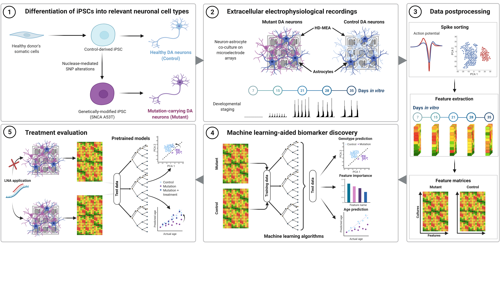

# Welcome to MADEB
The package for the **(M)achine learning (A)ided (D)iscovery of (E)xtracellular (B)iomarkers**:

Created with [BioRender](BioRender.com)

## Overview
MADEB was created to facilitate the analysis of extracellular recordings of neuronal cultures using high-density microelectrode arrays (HD-MEAs). MADEB allows users to easily:
- Extract electrophysiological features from spikesorted HD-MEA recordings
- Visualize differential developmental trajectories 
- Apply machine learning algorithms to classify different conditions
- Obtain biomarkers predictive of the respective condition
- Evaluate the effect of treatments

## Requirements
Currently MADEB is only available on MATLAB, so a recent MATLAB installation (>2019b) is required. We plan on expanding MADEB to Python in the near future.

If you want to use the [Notebooks](/Notebooks), you need to install [Jupyter lab or Jupyter notebook](https://jupyter.org/install) (`pip install jupyterlab` or `pip install notebook`) and the [MATLAB kernel](https://pypi.org/project/matlab-kernel/) (`pip install matlab_kernel`) + the [MATLAB API for Python](https://www.mathworks.com/help/matlab/matlab_external/install-the-matlab-engine-for-python.html). 

However, all analysis scripts are also available as MATLAB live scripts, which do not require any additional software. 

## Installation
The package is ready-to-use right after cloning. 

## Usage
Code requires spikesorted data in the [phy format](https://github.com/cortex-lab/phy). For help with spikesorting check out the [Spikeinterface package](https://spikeinterface.readthedocs.io/en/latest/). 

Different parts of the analysis are subdevided into different analysis scripts:
- [Feature extraction](/Notebooks/) (to be added)
- [Data exploration](/Notebooks/data_exploration.ipynb)
- [Classification analysis](/Notebooks/data_exploration.ipynb)
- [Treatment evaluation](/Notebooks/treatment_evaluation.ipynb)

## Citation
This package was published in "Electrophysiological classification of iPSC-derived dopaminergic neurons harbouring the SNCA-A53T mutation" and additionally contains code to replicate the figures used in the publication.
